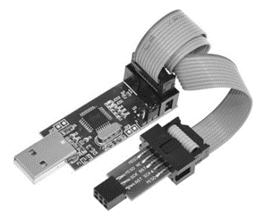
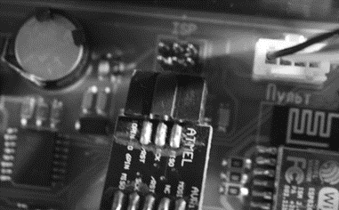
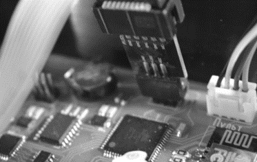
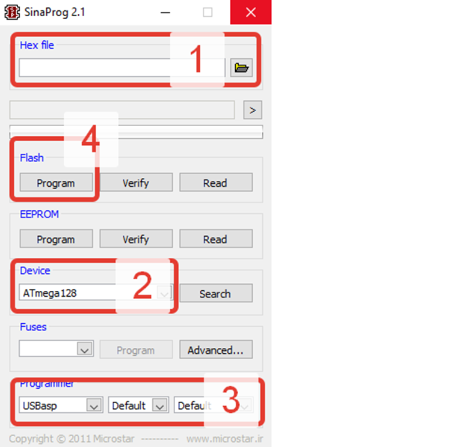

**Прошивки и инструкция в электронном виде будут выкладываться на том же сайте в разделе** [www.share-know.ru/ftp/](http://www.share-know.ru/ftp/)

Для обновления прошивки, на указанном сайте необходимо скачать программу во вкладке программатор **РАСПАКОВАТЬ архив себе на компьютер,** установить драйвер который находится так же в данной папке. Так же потребуется недорогой программатор с переходником и карта **microCD** **(объемом до 16Гб и отформатированной в систему FAT32).**

Программатор называется - Программатор USBASP для AVR микроконтроллеров с переходником с 10pin на 6pin.



---

*  

   

*  

   

*  

   



Программатор вставляется в плату в верхний правый разъем надписями (MISO, SCK, RST к радиатору охлаждения), при прошивке микроконтроллера экран должен быть отключен, далее в программе SinaProg выбирается прошивка, контроллер Atmega128, а так же программатор USBASP и нажимается кнопка программировать (БОЛЬШЕ НИКАКИЕ ВКЛАДКИ ТРОГАТЬ НЕЛЬЗЯ!!!)

После успешного окончания процесса можно перейти к прошивке экрана, для этого необходимо записать файл прошивки (прошивки разделены по цветам и размеру экрана, цвет экрана имеется в виду цвет платы экрана узнать его можно перевернув крышку корпуса на которой тот самый экран расположен) на карту MicroSD и вставить в специальный разъем сзади экрана, далее включить питание автоматики, дождаться успешного завершения, вытащить карту и перезагрузить устройство путем отключения и включения автоматики в розетку. На этом обновление прошивки окончено.

Проверить версию прошивку можно в общих настройках (прошивка экрана и платы должны совпадать)

**1 – Выбрать файл прошивки (файл не должен находиться в архиве, к пути файла избегать присутствия русских букв).**

**2 – Выбрать прошиваемый микроконтроллер Atmega128**

**3 – Выбрать используемый программатор USBASP**

**4 – Нажать кнопку прошить и дождаться завершения процесса.**

Прошивку контроллера можно выполнить и с телефона под управлением Android, программой **ZFlasherAVR**, но для этого понадобится специальный переходник для программатора (В программе так же выбирается файл для прошивки, контроллер Atmega128 и нажимается кнопка поехали, **остальные кнопки и вкладки в данной программе не трогать и не нажимать**).