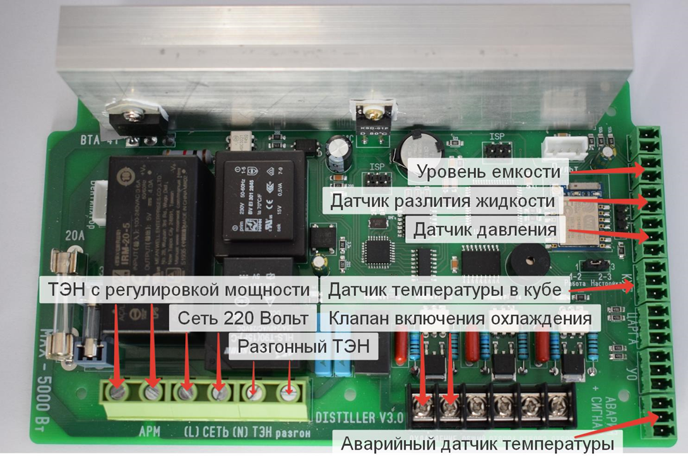

В режиме потстилл используются 2 датчика температуры (аварийный и датчик куба), остальные датчики в данном режиме работы могут быть отключены. Так же возможно подключение датчика разлития жидкости, датчик уровня и аварийный датчик давления.

Из силовых разъемов в данном режиме используются:

-  Сеть 220 вольт

-  ТЭН со стабилизацией

-  Разгонный ТЭН (не обязательно)

Клапан охлаждения (на данный разъем может так же быть подключен или чиллер или система автономного охлаждения). Реле на плате установлено на **5 Ампер**, при подключении двигателя или насоса мощность должна быть не более 300Вт иначе реле может залипнуть в одном положении

