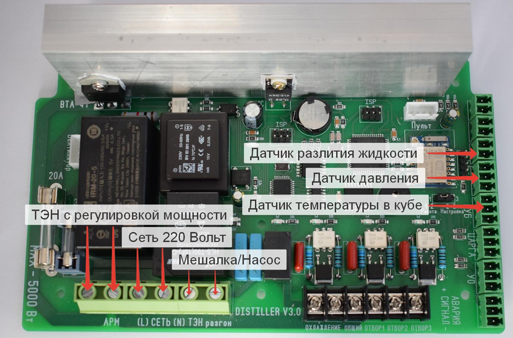

В режиме термопауз используется один датчик температуры который устанавливается в кубе, а так же по желанию датчик разлития жидкости.

Из силовых разъемов в данном режиме используются:

-  Сеть 220 вольт

-  ТЭН со стабилизацией

-  Мешалка либо насос

