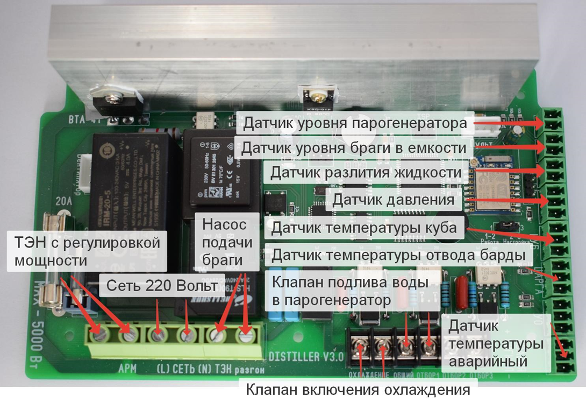

В режиме НБК колонны используется датчик температуры в бардаотводчике и датчик температуры в кубе, датчик давления в колонне, датчик разлития жидкости, а так же датчик уровня для опускания в брагу, датчик уровня воды в парогенераторе.

Установка датчиков уровня не обязательна, в случае не использования датчиков уровня на них нужно установить перемычку.

Из силовых разъемов в данном режиме используются:

-  Сеть 220 вольт

-  ТЭН со стабилизацией

-  Насос для НБК колонны

-  Клапан охлаждения (на данный разъем может так же быть подключен или чиллер или система автономного охлаждения)

-  Клапан подлива воды в парогенератор

