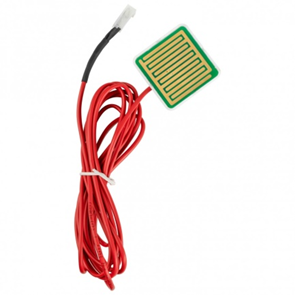
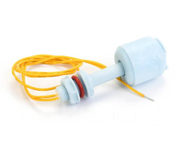
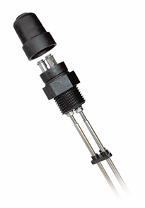
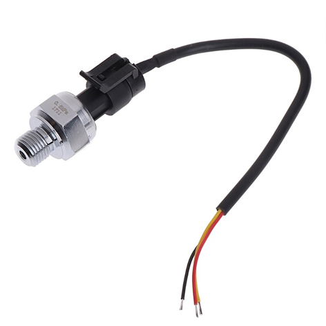
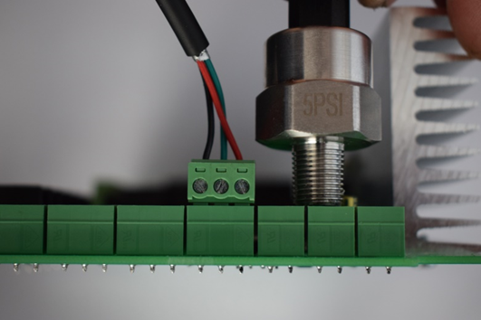
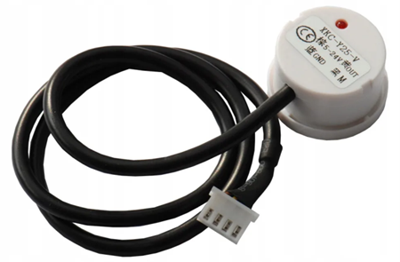

Всего к данной автоматике на данный момент, помимо температурных датчиков подключаются датчики уровня и датчик давления, в данном разделе будут описаны типы используемых датчиков.

**Датчики уровня**, подключаемые к данной автоматике основаны на проводимости жидкости, то есть имеется некая чувствительность у датчика и если по замерам микроконтроллера, проводимость у датчика на данный момент больше чем установлена в программе, то это дает основания микроконтроллеру полагать, что данный датчик находится в жидкости. Так как готовых датчиков в природе существует большое многообразие, и они отличаются размерами, толщиной электродов, расстоянием между электродами то соответственно чувствительность у таких датчиков будет отличаться. Для калибровки установленного датчика необходимо настроить в программе чувствительность датчика, как это сделать будет описано в следующем разделе.

**Важно!!!** При использовании отбора голов по уровню, желательно **пользоваться поплавковым датчиком с герконом**, так как у голов очень плохая проводимость (вследствие высокого содержания спирта), при увеличении чувствительности ближе к максимуму можно получить ложные срабатывания, которые исключены при использовании поплавкового датчика.



---

*  

   

*  

   

*  

   



**Датчик давления** используется трехпроводный **с питанием 5 вольт**, датчик берется на минимальное давление 5PSI либо 10PSI, для того чтобы обеспечить высокую чувствительность. Датчик такого типа представлен на картинке ниже, а так же подключение данного датчика к плате.



---

*  

   

*  

   



Данный датчик может работать как с жидкостью, так и с паром, имеет резьбу для жесткой и герметичной фиксации на колонну либо в куб или парогенератор.

**Датчик уровня** так же можно использовать **бесконтактный**, в этом случае питание датчика берется с клеммы датчика давления с зеленой фишки с правой стороны платы (параллельно датчику давления верхний контакт +5 вольт нижний -5 вольт), остальные 2 провода с бесконтактного датчика подключаются в нужный разъем уровня (если датчик при этом не заработал, необходимо эти 2 провода поменять местами)

