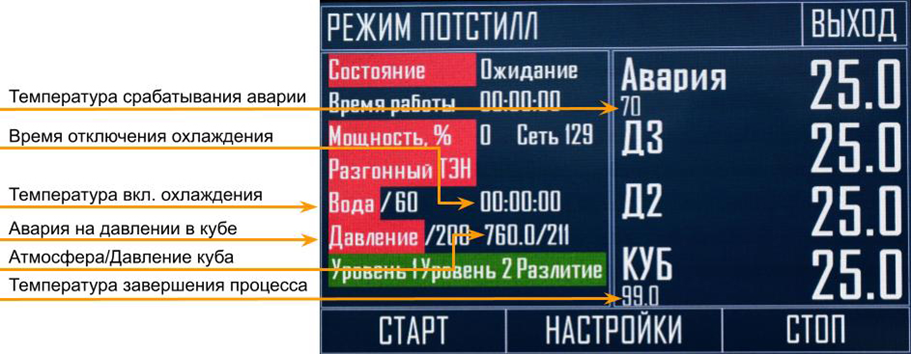
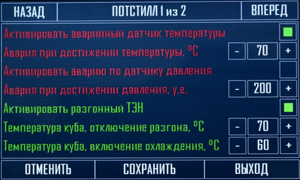
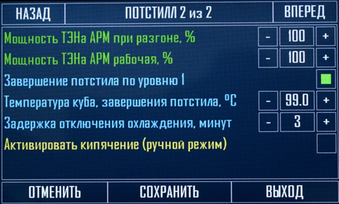
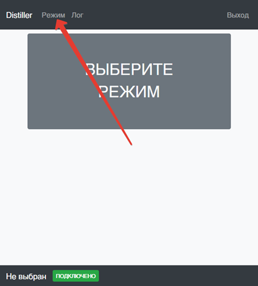
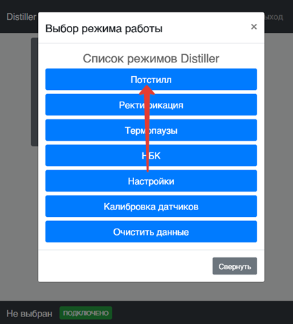
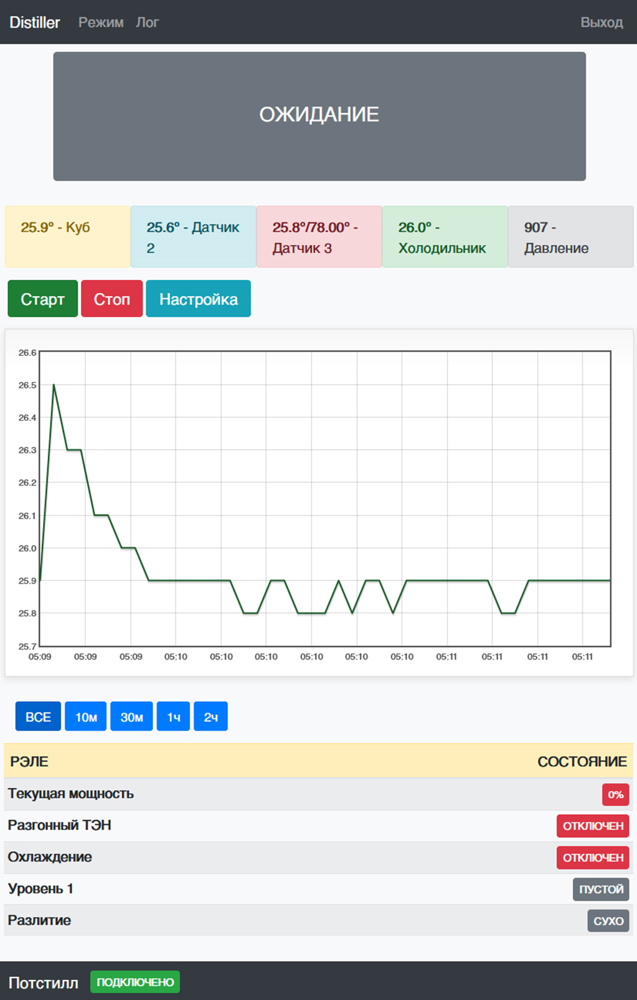
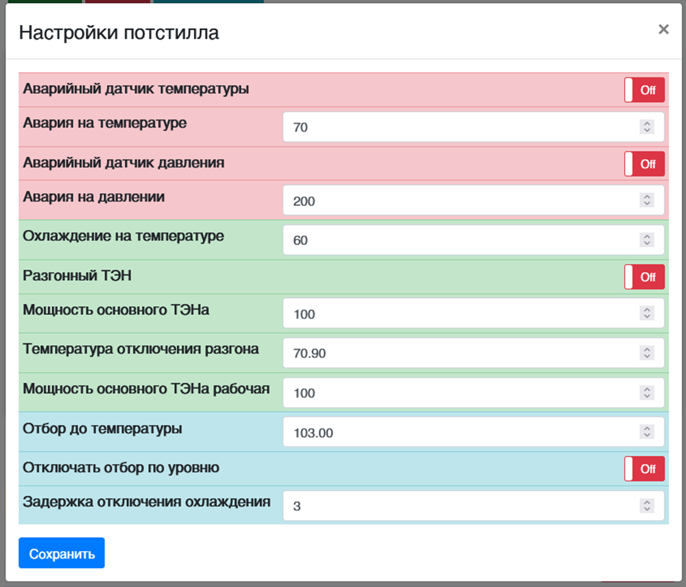

Пожалуй самым простым режимом работы, является режим потстилл, в данной автоматике он присутствует по двум причинам, во первых обеспечить безопасность при выполнении данного процесса, а во вторых освободить пользователя от слежения за процессом. Соответственно настроек у данного режима не так много.

Для начала определимся, что показывается на основном экране при работе.

Вверху название текущей страницы, слева кнопка **выход** (для перехода в основное меню, если режим потстилл в данный момент запущен, то выйти в основное меню не получится, только после остановки процесса, кнопку можно будет нажать).

Снизу находятся управляющие кнопки для **запуска и остановки**, а так же переход в **настройки** текущего режима (параметры можно менять при запущенном процессе.)

Посередине располагаются четыре информационных поля, справа отображается температура, куба и холодильника (на связи с атмосферой) и дополнительных датчиков которые могут потребоваться для контроля температуры в других зонах.

Слева отображается текущее состояние, время прошедшее после запуска процесса, текущая мощность на ТЭНе (с регулировкой мощности). Надписи разгонный ТЭН и охлаждение окрашиваются двумя цветами, а именно зеленым и красным. Красный цвет означает, что оборудование отключено, зеленым – включено.

Название давление и авария могут окрашиваться в красный цвет (это означает, что в настройках данные датчики игнорируются)

Так же на основном экране отображается текущее давление в кубе (если установлен датчик давления), а так же текущее атмосферное давление (если данный датчик не установлен, то давление всегда будет показывать 760).

Перейдем к настройкам режима потстилл.

1\.        **Активировать аварийный датчик температуры** - активирует слежение за аварийным датчиком (который устанавливается на связь с атмосферой). Данный параметр напрямую связан с **T° срабатывания аварии (6).** В случае превышения мощности, либо при внезапном пропадании охлаждения, пары начнут прорываться через трубку связи с атмосферой нагревая при этом аварийный датчик, после чего произойдет аварийное отключение системы, высветится уведомление о перегреве холодильника и автоматика будет издавать длинные писки, пока не закрыть уведомление.

2\.        **Авария при достижении температуры -** о данной температуре упоминалось во второй настройке потстилла, если вторая настройка активирована, и температура на связи с атмосферой превысит заданное значение, то произойдет аварийная остановка системы, то есть охлаждение и ТЭНы будут отключены и весь процесс остановлен.

3\.        **Активировать аварию по датчику давления –** данная настройка активирует, аварийный датчик давления в кубе.

4\.        **Авария при достижении давления** – давление, на котором произойдет аварийная остановка системы, то есть охлаждение и ТЭНы будут отключены и весь процесс остановлен.

5\.        **Активировать разгонный ТЭН** - означает что при старте режима потстилл будет запущен второй ТЭН (без регулировки мощности), данный параметр напрямую связан с **T° отключения разгона (4).**

6\.        **Температура куба отключение разгона** - при достижении в кубе заданной температуры, будет отключен разгонный ТЭН (без регулировки мощности).

7\.        **Температура куба включения охлаждения** - если у вас подключен клапан на охлаждение, либо автономная охлаждающая система, то при достижении в кубе данной температуры, оно автоматически будет включено.

8\.        **Мощность ТЭНа АРМ при разгоне -** данная настройка предназначена для тех, у кого слабая проводка или слабый холодильник, а ТЭН установлен довольно большой мощности. Данный параметр воздействует на ТЭН (с регулировкой мощности и стабилизацией), выставляется данный параметр в процентах от максимальной мощности. Например, ТЭН установлен на 6кВт при установке данного значения 10 на выходе будет 600 Вт, при установке 50 на выходе будет 3кВт.

9\.        **Мощность ТЭНа АРМ рабочая –** это мощность, на которую перейдет ТЭН с регулировкой мощности, когда температуре в кубе превысит **Температуру отключения разгона.**

10\.        **Завершение потстилла по уровню 1** – если использовать данную настройку то завершение процесса произойдет когда спирт сырец достанет до датчика уровня подключенного к разъему **уровень 1 (головы)**, данная настройка не отключает завершение отбора по температуре, если температура в кубе превысит выставленную температуру **завершение отбора °С**, то процесс так же завершится.

11\.        **Температура куба завершение потстилла °С** - температура в кубе при которой прекратится процесс потстилл и автоматика перейдет в режим ожидания, при этом будет издавать звуковой сигнал и показывать уведомление об успешном завершении процесса, при закрытии которого звуковой сигнал прекратится.

12\.        **Задержка отключения охлаждения, мин** - после завершения режима потстилл по температуре либо по уровню в емкости, процесс будет остановлен, ТЭНы отключены, но охлаждение будет работать еще заданное количество минут, спустя это время отключится и охлаждение. Это сделано для того, что бы не пошли пары через связь с атмосферой, если используется, например ПВК, который из-за инерционности будет кипеть еще некоторое время.

13\.        **Активировать кипячение (ручной режим)** – завершение потстила не происходит ни по датчику температуры ни по температуре в кубе, остановка режима возможна только при аварии либо в ручная остановка.

Все данные параметры доступны для изменения так же и при удаленном доступе, рассмотрим и его, находясь на сайте нужно вызвать главное меню и выбрать режим потстилл, откроется страница, которая представлена ниже.



---

*  

   

*  

   



В верхней части располагается информационное поле (в котором написано ожидание), в процессе работы на нем будет отображаться, сколько прошло времени после запуска процесса, текущее состояние, а так же в случае ошибки и остановки процесса произошедшая ошибка либо что процесс завершен.

Ниже находятся два информационных поля отображающих текущую температуру в кубе и аварийного датчика на связи с атмосферой, под ними расположены управляющие кнопки, **старт** (запускает программу потстилл), **стоп** (останавливает программу потстилл) и **настройки** (выводит на экран настройки режима потстилл).

Далее идет график температуры в кубе, нижняя шкала соответствует времени, которое вы выставили в основных настройках, то есть будет отображаться ваше текущее время.

**Внимание!!!** Чтобы стереть график и он начался заново, например, для запуска новой перегонки, необходимо вызвать главное меню (как при выборе режима потстилл), и выбрать самый нижний пункт **очистить данные**, и согласиться с выскочившим предложением, все данные в этом случае будут удалены и график пойдет с текущего момента, данную операцию можно производить в любое время, даже при выполнении программы. Программа при этом не собьется, просто график начнется заново с текущего момента.

Под графиком расположены временные кнопки, нажимая на которые можно просмотреть график за разные временные промежутки.

Ниже расположена информационная таблица о текущем состоянии силовых элементов, а так же датчиков уровня.

Рассмотрим возможность управления настройками режима потстилл удаленно, для этого необходимо нажать на кнопку **настройка** находящуюся над графиком (при нажатии на кнопку устройство должно быть соединено с интернетом и быть связано с сайтом, об этом свидетельствует надпись внизу экрана слева – **подключено**. Если в момент нажатия на настройки будет выведена надпись **отключено**, то ничего не произойдет, так как сайт в момент нажатия на кнопку обращается к автоматике и получает с нее данные.)

Настройки, открываются в модальном окне и полностью соответствуют описанным ранее на сенсорном экране, при изменении настроек необходимо нажать внизу кнопку сохранить (появится второе модальное окно, которое уведомляет, что идет сохранение данных, как только оно исчезнет, окно настроек можно закрывать).

Так же как и через сенсорный экран настройки можно менять и при запущенном режиме.

Если произошла авария, или режим потстилл завершился, уведомление или ошибку можно снять и удаленно, достаточно нажать кнопку стоп на веб интерфейсе.