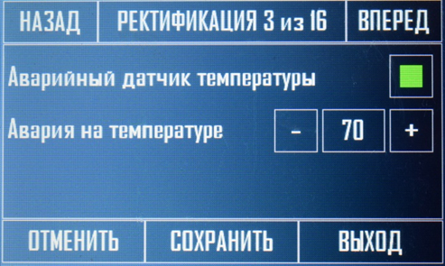
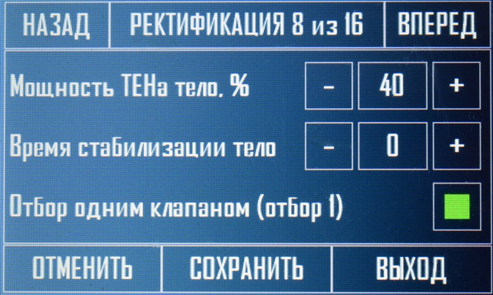

Самым сложным режимом в данной автоматике является ректификация, она имеет достаточно большое количество настроек, для обеспечения гибкости и совместимости со всеми колоннами.

Начнем рассмотрение данного режима с описания главного экрана, ниже представлено фото экрана в режиме ректификация.

В верхней части экрана располагается информационная строка, в ней написан текущий режим, текущая операция и время прошедшее после запуска ректификации.

Ниже справа располагается поле, отображающее температуры на всех датчиках, датчик в царге и аварийный датчик необязательны, но желательны, тем более они идут в комплекте.

Слева располагается дополнительное информационное поле, в нем указывается:

**Время операции** – это универсальное поле и в зависимости от текущего состоянии колонны может показывать разные значения. Например, оставшееся время до конца стабилизации колонны, обратный отсчет до перехода в отбор тела при стабильной температуре, оставшееся время до открытия клапана по счетчику и другие операции.

**Мощность ТЭНа** – это текущая мощность, подаваемая на ТЭН с регулировкой мощности и стабилизацией.

Далее идут надписи, которые окрашиваются в 2 цвета, по аналогии с режимом потстилл. В зависимости от цвета показывают, включен ли разгонный ТЭН, включено ли охлаждение, открыты ли клапана отбора.

Следующая строчка показывает текущее напряжение в сети.

Так же на главном экране отображается атмосферное давление, и давление в колонне, если данные датчики подключены.

Перейдем к описанию настроек и принципа работы автоматики на ректификационной колонне.

**1\. Активировать разгонный ТЭН** – означает что при старте ректификации будет включен разгонный ТЭН.

**2\. Мощность ТЭНа при разгоне –** мощность, подаваемая на ТЭН со стабилизацией **АРМ** при разгоне (не зависит от температуры отключения разгона, то есть при достижении в кубе температуры отключения разгона, данный ТЭН продолжит работать с текущей мощностью).

**3\. Т° отключения разгона** – при какой температуре в кубе будет отключен разгонный ТЭН (связано с 1 параметром).

**4\. Т° включения охлаждения** – на какой температуре в **кубе** будет подано охлаждение (открыт клапан воды или подано питание на чиллер либо автономную систему охлаждения).

**5\. Задержка отключения охлаждения –** по аналогии с потстиллом, сколько должно проработать охлаждение после завершения процесса ректификации и отключения ТЭНов.

**6\. Датчик разлития жидкости –** данный параметр активирует датчик разлития, при появлении жидкости на датчике процесс останавливается и все оборудование отключается, автоматика издает звуковой сигнал и выводит сообщение о разлитии. **Внимание!!!** Данный параметр активируется в ректификации и действует на все режимы (потстилл, НБК, термопаузы, ректификация)! Сообщение об ошибке снимается нажатием кнопки **ок** на дисплее на странице уведомления.



---

*  

   

*  

   



\*\*7. Аварийный датчик температуры –\*\*по аналогии с потстиллом включает слежение за аварийным датчиком, который устанавливается на связь с атмосферой.

**8\. Авария на температуре –** температура срабатывания аварийного датчика.

**9\. Аварийный датчик давления –** данная настройка активирует, аварийный датчик давления в кубе. (если он установлен).

**10\.  Давление аварии** – давление, на котором произойдет аварийная остановка системы, то есть охлаждение и ТЭНы будут отключены и весь процесс остановлен.



---

*  

   

*  

   



**11\.        Т** ° **начала стабилизации** – это температура в **узле отбора,** при которой запустится процесс стабилизации колонны, при этом ТЭН с регулировкой мощности (**АРМ**) перейдет на мощность отбора голов, при этом на экране запустится обратный отсчет времени стабилизации, после которого начнется процесс отбора голов.

**12\.        Время стабилизации головы –** данный параметр относится к **11 параметру,** обратный отсчет будет идти именно данное время.

**13\.        Мощность ТЭНа головы –** это мощность, подаваемая на ТЭН с регулировкой при отборе голов.

**14\.        Открытие клапана головы –** время, которое клапан будет открыт при отборе голов (при отборе клапан закрывается на время указанное в **параметре 15,** после клапан открывается на указанное время и цикл повторяется).

**15\.        Закрытие клапана головы –** этот параметр означает, сколько секунд клапан должен быть закрыт при отборе голов, тем самым обеспечивая формирование спиртовой полки (это время колонна работает сама на себя).

**16\.        Отбор голов по уровню 1 –** выставление данного параметра означает, что при срабатывании **датчика уровня 1 (головы)**, процесс перейдет на отбор тела. Данный параметр имеет приоритет над срабатыванием по температуре, но не имеет приоритета над отбором голов по времени, то есть если активирован параметр 17, отбор голов по уровню осуществляться не будет. **ВАЖНО!!! При срабатывании датчика уровня параметр Температура отбора тела будет автоматически изменен и сохранен на текущие показания датчика в узле отбора. То есть текущая температура будет считаться началом отбора тела.** Но данная температура в последствии может быть откорректирована пользователем в рабочем режиме.



---

*  

   

*  

   



**17\.        Отбор голов по времени** – данная настройка активирует отбор голов по выставленному времени, она имеет приоритет над отбором по уровню и отбор голов по температуре.

**18\.         Время отбора голов –** эта настройка будет работать, если предыдущая активирована, выставляется в минутах, по окончанию времени программа перейдет к отбору тела. **ВАЖНО!!! При завершении обратного отсчета, параметр Температура отбора тела будет автоматически изменен и сохранен на текущие показания датчика в узле отбора. То есть текущая температура будет считаться началом отбора тела.** Но данная температура в последствии может быть откорректирована пользователем в рабочем режиме.

**19\.        Время стабильности температуры –** если не активирована настройка 16 или 18 начало отбора тела начнется по температуре, в **узле отбора** выставленной в параметре 26, данный параметр необходим, так как при отборе голов температура может иногда прыгать и доходить до температуры начала отбора тела, а потом возвращаться обратно. Чтобы не произошло моментального перескока на отбор тела, существует данный параметр. Он определяет, сколько минут температура должна продержаться, прежде чем автоматика перейдет на отбор тела, если температура упала, то счетчик обнуляется и при следующем скачке отсчет начинается заново.

**20\.        Мощность ТЭНа тело–** это мощность подаваемая на ТЭН с регулировкой при отборе тела и отборе хвостов. Данная мощность установится сразу после завершения отбора тела.

**21\.         Время стабилизации тела –** параметр определяет, сколько колонна будет работать на себя после завершения отбора голов, может принимать значение 0, тогда отбор тела будет происходить сразу после отбора голов.

**22\.        Отбор одним клапаном (отбор 1) –** если не хочется городить конструкцию из двух или трех клапанов и есть возможность сменить ёмкость, то необходимо активировать данный параметр. При этом единственный клапан подключается на **клемму отбора голов (то есть отбор 1)**. Принцип работы будет заключаться в следующем, как только закончился отбор голов, колонна перейдет либо в стабилизацию, либо в отбор тела, мощность переключится, клапан отбора голов закроется. Автоматика начнет издавать звуковой сигнал и высветится уведомление, что необходимо сменить емкость. После смены емкости и закрытия уведомления, процесс продолжится, то есть будет отбираться тело либо идти стабилизация. Если выставлен **36 параметр**, то после отбора тела, данный алгоритм повторится, но уже для хвостов.



---

*  

   

*  

   



**23\.        Открытие клапана тела –** время которое клапан открывается в режиме отбора тела (данный параметр работает идентично **параметру 14**).

**24\.        Закрытие клапана тело –** по аналогии с **параметром 15**, только используется при отборе тела.

**25\.        Декремент, секунд –** данный параметр имеет очень важное значение, он дает возможность завершить процесс ректификации. Используется только при отборе тела, обеспечивая плавное уменьшение скорости отбора тела к концу перегона (может принимать нулевое значение). Воздействуя на **параметр 24**, а именно увеличивая его. **К данному параметру мы вернемся чуть позже, когда рассмотрим еще один связанный параметр 33.**

**26\.        Температура отбора тела –** это температура в **узле отбора**, о которой было сказано выше. (если ведется отбор голов по уровню или по времени, то перед началом ректификации данный параметр изменять не требуется.)

**27\.        Отбор тела по уровню 2** – если принято решение отбирать тело по уровню в емкости, необходимо активировать данный параметр. Он имеет приоритет над **параметрами 33 и 34,** если установлен данный параметр, то пункты **33,34 и 35** изменять не нужно, в процессе они участвовать не будут.



---

*  

   

*  

   



**28\.        Активировать датчик в царге –** если датчик в царге установлен и данный параметр активирован, то превышении дельты (следующий параметр), клапан отбора будет перекрываться ожидая стабилизации температуры в царге, работает так же как датчик в узле отбора (так же данный параметр будет влиять на декремент и соответственно уменьшение отбора).

**29\.        Дельта царги –** допустимое изменение температуры в царге, при превышении дельты, данный параметр используется, только если активирован предыдущий параметр.

**30\.         Дельта узел отбора –** по аналогии с дельтой царги, только ориентироваться автоматика будет в данном случае на температуру в узле отбора (влияет на декремент и соответственно на уменьшение скорости отбора).

**31\.        Отбор по разнице температур ТЦ, ТУО –** данный режим работает при установке двух датчиков в царге, он имеет приоритет над другими режимами, работа данного режима заключается замере разницы температур между двумя датчиками и сравнение с допустимой (следующий параметр), декремент и отбор в данном режиме работает, так же как и в других режимах. Главная особенность данного режима состоит в том, что на него не действует атмосферное давление. При активации данного режима установка **параметров 28, 29, 30** не требуется, использоваться в работе они не будут

**32\.        Разница температур –** относится к предыдущему параметру, это допустимая разница между датчиками температуры в царге.

**33\.        Время завершения тела, мин –** прямо относится к **параметру 25** (где было сказано, что мы вернемся к данному параметру). И так данный параметр можно назвать как максимальное время закрытого клапана для перехода в отбор хвостов, либо для завершения процесса. Обеспечивается это следующим образом. Допустим у вас выставлено на отборе тела 1 секунду клапан открыт и 10 секунд клапан закрыт, обеспечивая нужную скорость отбора, но к концу погона температура начнет расти и нужно уменьшать отбор. Как только температура превысит выставленную дельту в царге или узле отбора, клапан будет перекрыт в любом случае, но отсчет на открытие и закрытие клапана будет в программе продолжаться. В данный момент колонна будет работать на себя, формируя спиртовую полку и ожидать падения температуры. Как выше было сказано отсчет при этом продолжается и как только он подойдет к моменту открытия клапана, он не откроется, так как превышена дельта, в этот момент к времени закрытого клапана добавится тот самый декремент. Предположим, декремент выставлен 5 секунд, следовательно, время закрытого клапана станет 15 секунд, и опять начнется обратный отсчет. Температура упадет и по окончанию процесса клапан откроется и сольет спирт, некоторое время процесс будет идти стабильно, так как отбор уменьшен, но все чаще и чаще будут происходить такие скачки. Данный процесс накидывания декремента будет продолжаться, то есть клапан будет закрыт 20, 25, 30 секунд и так далее. Так вот **Время завершения тела** это максимальное время закрытого клапана из-за накинутого декремента, когда нужно остановиться отбирать тело и перейти к отбору хвостов или к завершению процесса, **данный режим завершения тела имеет самый низкий приоритет, для работы по данному режиму параметры 34 и 27 должны быть отключены.**



---

*  

   

*  

   



**34\.        Отбор тела до температуры в кубе –** при активации данного параметра, отбор тела будет идти до тех пор пока температура в кубе не превысит выставленную в **параметре 35.** При этом уменьшение скорости отбора по декременту так же будет работать. **Для работы в данном режиме параметр 27 должен быть отключен, как как отбор по уровню имеет приоритет над отбором до температуры в кубе.**

**35\.        Температура куба завершения тела –** температура в кубе при которой завершится отбор тела, используется только если активирован **параметр 34.**

**36\.        Отбор хвостов после отбора тела –** определяет будут ли отбираться хвосты после окончания отбора тела или следует завершить процесс.

**37\.        Мощность тела хвосты –** мощность ТЭНа с регулировкой (АРМ) при которой будут отбираться хвосты, используется если активирован **параметр 36**

**38\.        Активировать нижний узел отбора –** включает нижний узел отбора, для его работы необходим еще один клапан, который подключается к **отбору 3,** данный режим позволяет отбирать хвосты непосредственно в процессе отбора голов и тела. При выставлении данного параметра, **параметр 36** необходимо отключить.



---

*  

   

*  

   



**39\.        Температура куба завершения хвостов –** это температура в кубе при которой следует завершить процесс ректификации (актуально, только если активирован **параметр 36**).

**40\.        Температура начала НУО –** это температура, при которой клапан нижнего узла отбора начнет свою работу (то есть с какой температуры в **кубе** начнется отбор хвостов).

**41\.        Открытие клапана НУО –** время, на которое будет открываться клапан нижнего узла отбора (по аналогии с отбором тела и голов).

**42\.        Закрытие клапана НУО –** время, на которое будет закрываться клапан нижнего узла отбора (по аналогии с отбором тела и голов).

При работе режима ректификации его можно поставить на паузу нажатием кнопки завершить ректификацию, это вызовет дополнительное меню с кнопками (показанное ниже), вызов данного меню приостановит работу клапанов отбора и колонна будет работать на себя. В данном меню можно открыть/закрыть любой клапан отбора, открыть/закрыть клапан охлаждения, включить/выключить разгонный ТЭН и ТЭН с регулировкой мощности, так же можно пропустить текущий шаг, например стабилизацию или отбор голов и др. Если нажать кнопку завершить ректификацию в данном меню, то ректификация будет остановлена. При нажатии кнопки закрыть, колонна вернется в приостановленный режим и продолжит работу.

Все параметры описаны, теперь перейдем к описанию подключения (если требуется), **отбора по пару**. Для данного режима нам понадобится, шаровый кран с электроприводом на 220 вольт и реле на 220 вольт, фотографии данных принадлежностей представлены ниже.

В данном режиме необходимо выставить несколько специфичные настройки, в зависимости от того на какой стадии будет использоваться отбор по пару (в инструкции мы будем использовать отбор по пару на стадии отбора тела). **Параметр 24** необходимо выставить равным 0, **параметр 25** так же необходимо выставить равным 0, остальные настройки идентичны отбору по жидкости. Рекомендуется перед шаровым краном с электроприводом или после него установить дублирующий шаровый кран (ручной), которым выставить первоначальный отбор, иначе клапан с электроприводом будет очень часто срабатывать.

Принцип работы по пару, следующий, кран откроется полностью и будет происходить отбор со скоростью, которая установлена дублирующим краном, как только температура превысит установленную дельту, то кран закроется, и будет ожидать падения температуры. Для того чтобы кран постоянно не открывался и не закрывался выставлен **параметр 24** равный нулю и чтобы не накидывался декремент **параметр 25** так же равен 0. Окончание процесса отбора тела так же произойдет по **параметру 22** как и при отборе по жидкости, если шаровый кран будет закрыт установленное время, а температура не будет падать, то произойдет завершение процесса, либо по температуре в кубе, либо по уровню, смотря какой отбор у вас установлен.



---

*  

   

*  

   



После приобретения данных комплектующих их нужно особым образом соединить, принцип работы следующий, необходимо чтобы на провода, отвечающие за закрытие, постоянно поступало напряжение 220 вольт (у электропривода встроены микровыключатели, когда он доходит до крайнего положения, то цепь внутри него разрывается, и напряжение на обмотку двигателя поступать не будет.) Как только придет напряжение на открытие клапана, сработает промежуточное реле, которое разорвет цепь на закрытие клапана и подаст его не другие контакты, отвечающие за открытие клапана. Ниже представлена схема электрическая соединения.

Рассмотрим web интерфейс режима ректификации, фото главного экрана представлено ниже, перейти в него можно через главное меню, так же как и с режимом потстилл.

В самом верху страницы отображается текущее состояние (ожидание, головы, тело или какие либо уведомления об ошибках). Ниже располагаются текущие показания датчиков температуры, обновляются они на сайте раз в 3 секунды.

После перехода на отбор тела температура на царге, будет установлена через дробь, так как это отражено на узле отбора, если данный датчик задействован (активирован в меню), то температура, текущая при переходе на тело сохранится и именно от нее, будет отсчитываться дельта царги.

У узла отбора данная температура берется из настроек начала отбора тела, но не всегда, если был выбран отбор голов по уровню, то данная температура при срабатывании датчика уровня так же запомнится и автоматически сохранится в настройках, от нее будет отсчитываться дельта узла отбора.

Ниже по аналогии с потстиллом отображаются кнопки управления, но в данном режиме появляется еще одна кнопка управления (**пропуск шага),** служит для перескакивания стабилизации, отбора голов и д.р. например, если головы были отобраны ранее или ректификация была перезапущена, под ними находится график температур, который так же можно очистить по аналогии с потстиллом. На графике не отображается температура на носике связи с атмосферой, так как она обычно мала и график будет сложно анализировать (то есть скачки на 0,1 градус увидеть будет проблематично).

Под графиком располагается текущие состояния силовых модулей и датчиков разлития, они окрашиваются красным, если отключено и зеленым, если клапан или ТЭН в данный момент работает.

При нажатии  кнопки настройки выводится окно со всеми настройками режима ректификации, они полностью дублируют настройки на сенсорном экране, поэтому рассматривать их не имеет смысла.

Для режима ректификации в процессе прохождения данного режима отправляются микро данные о происходящих процессах, при открытии страницы логов (в любое время) можно посмотреть текущий отчет (эти данные расшифровываются сервером), в отчете можно понять, почему произошло то или иное действие и внести, необходимые корректировки в настройки ректификации. Часть типового отчета представлена ниже на рисунке.

