Перейдя на сенсорном экране из главного меню в режим термопауз, будет отображено следующее окно.



---

*  

   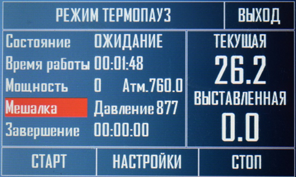

*  

   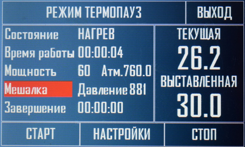



На главном экране, как и в других режимах, отображается текущий статус работы, время работы, текущая поданная мощность на ТЭН, работает или нет в данный момент насос либо мешалка, нижний пункт **Завершение** будет показывать оставшееся время до окончания текущей термопаузы. Справа на главном экране отображается текущая температура в кубе и та температура, которая выставлена для текущей термопаузы, пока режим не запущен нижняя температура будет отображаться 0.

Рассмотрим настройки данного режима.



---

*  

   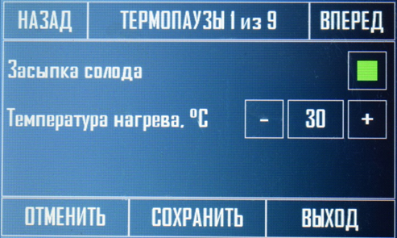

*  

   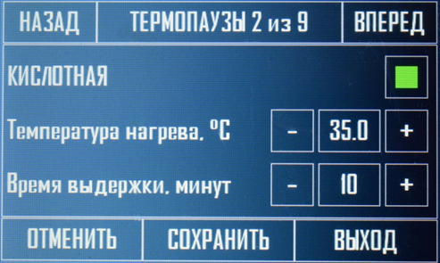



**1\. Засыпка солода** – активация засыпки солода, емкость будет разогрета до выставленной температуры, прибор будет издавать звуковой сигнал и выводить сообщение о необходимости засыпать солод, после выполнения данной операции необходимо нажать продолжить.

**2\. Температура нагрева** – это температура, до которой будет разогрета емкость до подачи уведомления и отключения ТЭНа.

**3\. Кислотная –** это активация кислотной термопаузы. Каждую термопаузу можно отключить или включить в зависимости от рецепта.

**4\. Температура нагрева –** до какой температуры будет нагрета емкость до начала отсчета времени удержания данной температуры при кислотной паузе.

**5\. Время выдержки –** выставляется в минутах, сколько времени будет удерживаться данная термопауза.

Всего в режиме 5 термопауз, пункты меню указанные ниже:

-  **6,7,8**

-  **9,10,11**

-  **12,13,14**

-  **15,16,17**

Выставляются в зависимости от надобности как **3,4,5** пункт, данные термопаузы будут срабатывать последовательно (если активированы), в соответствии с очередностью меню.



---

*  

   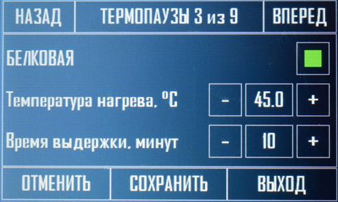

*  

   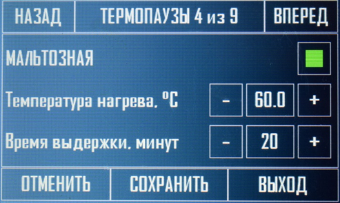

---

*  

   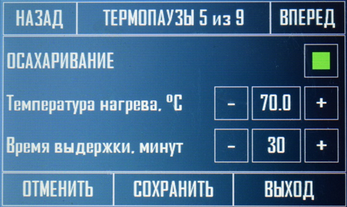

*  

   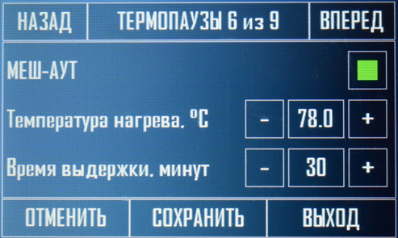



Следующие пункты меню важны и относятся к стабильности процесса нагрева, подбираются экспериментально для своего оборудования.



---

*  

   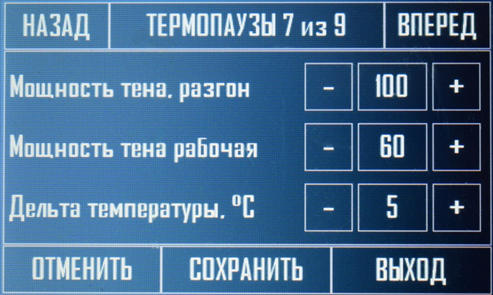

*  

   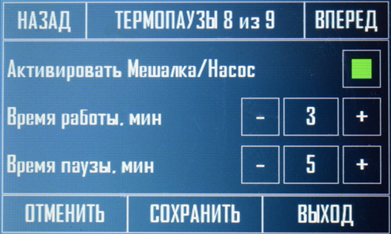



**18\. Мощность ТЭНа, разгон** – выставляется в процентах от максимальной мощности установленного ТЭНа, используется для первичного и быстрого разогрева емкости.

**19\.** **Мощность ТЭНа рабочая** – так же выставляется в процентах, на данной мощности происходит доведение содержимого емкости до установленной температуры, а так же последующее поддержание заданной температуры, выставленное время.

**20\.** **Дельта температуры –** это разница температуры между текущей и выставленной для перехода ТЭНа на рабочую мощность. (допустим температура паузы выставлена 50 градусов, необходимо ее выдержать 1 час, дельта установлена на 5 градусов, соответственно когда температура в емкости достигнет 45 градусов, мощность ТЭНа переключится на рабочую, сглаживая тем самым инерционность).

**21\.** **Активировать мешалка/насос** – активирует включение мешалки или насоса подключенных к клеммам разгонного ТЭНа. Насос или мешалка будут срабатывать на всех пяти термопаузах.

**22\.** **Время работы** – выставляется в минутах, сколько времени мешалка или насос будут находиться в работе.

**23\.** **Время паузы** – выставляется в минутах, сколько времени мешалка или насос будут находиться в выключенном состоянии.

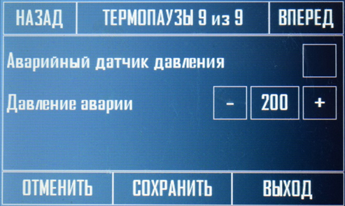

**24\.     Аварийный датчик давления –** данная настройка активирует, аварийный датчик давления в кубе.

**25\.     Давление аварии** – давление, на котором произойдет аварийная остановка системы, то есть охлаждение и ТЭНы будут отключены и весь процесс остановлен.

Рассмотрим WEB интерфейс данного режима, в который можно перейти через главное меню сайта.

На веб интерфейсе расположен только один график, это температура в кубе, так же текущая мощность в процентах, напряжение в сети и работает или нет мешалка или насос. Если перейти в настройки данного режима они полностью дублируются из интерфейса сенсорного экрана. В веб интерфейсе эти настройки быстро можно поменять и сохранить.

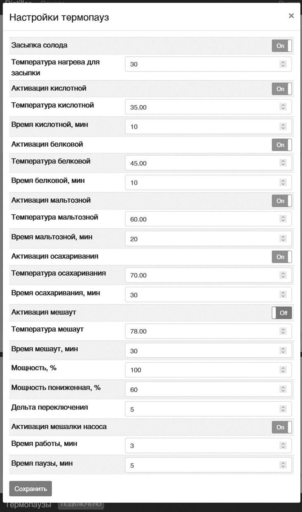
