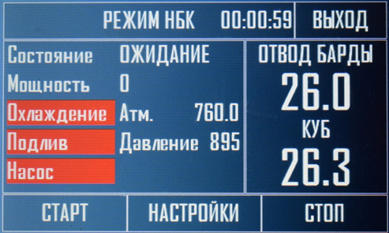
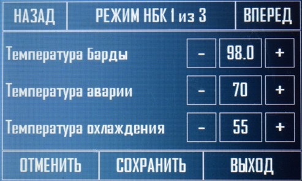
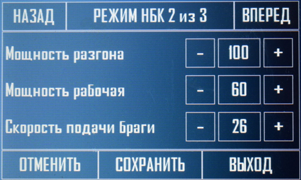
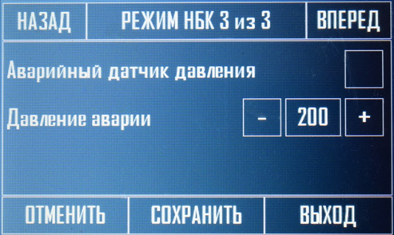
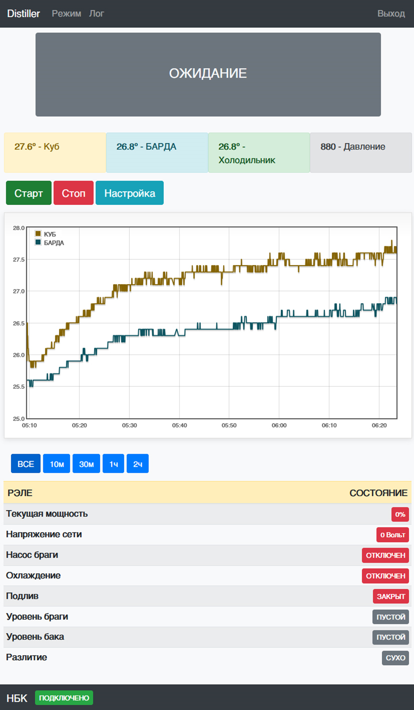
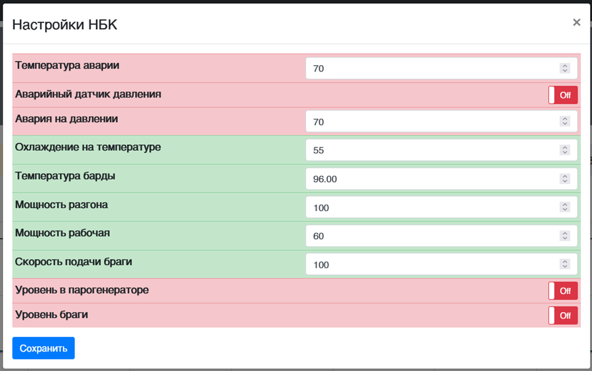

Данный режим используется для непрерывного перегона браги в спирт сырец, при помощи перистальтического или шестерёнчатого насоса. В данном режиме, куб выполняет роль парогенератора, в него заливается вода и ТЭН поддерживает непрерывное кипение, так как температура кипения спирта меньше температуры кипения воды, легкокипящие фракции, превращаясь в пар, попадают в отбор, а барда (отработанная брага), вместе с водой, стекает в бардоотводчик, где под давлением выдавливается в канализацию. Данный процесс протекает до тех пор, пока не закончится брага в емкости.

По подключению всего оборудования доступного в режиме НБК приведено на картинке в пункте **3\.4** данной инструкции.

В режиме НБК, можно использовать автоматический подлив воды, при установленном уровне жидкости в баке или отдельном отсеке и подключение клапана подачи воды в парогенератор (который подключается вместо отбора 1).

Если данную функцию не планируется использовать то, **датчик уровня 2** (датчик подлива в парогенератор), необходимо закоротить перемычкой.

Так же в данном режиме используется датчик **уровня 1** (датчик уровня браги). Как только брага в емкости закончится, процесс прекратится. Если не планируется использовать данный датчик уровня, то его так же необходимо закоротить перемычкой.

Возможно подключение датчика разлития жидкости, обычно он ставится под НБК насосом, в случае если шланг лопнет, то процесс так же остановится.

В режиме НБК так же используется аварийный датчик на пары, который ставится на носик связи с атмосферой.

Насос НБК подключается к разгонному ТЭНу (**насос НБК должен иметь свое управление оборотами либо использовать небольшой кран для регулировки скорости подачи браги**).

Ниже приведено фото главного экрана работы с НБК колонной.

Информация на главном экране в режиме НБК, ничем не отличается от других режимов, за исключением использования датчика давления, на данный момент он несет информационное значение (в следующих прошивках он будет использоваться именно в режимах работы.) Рассмотрим настройки данного режима.



---

*  

   

*  

   



**1\. Температура барды –** это температура при которой будет включаться перистальтический насос, если температура в результате подлива упала, то насос будет отключен, пока не будет достигнута заданная температура.

**2\. Температура аварии –** это температура на аварийном датчике, если охлаждение будет не достаточным либо вовсе пропадет, данная установка поможет отключить устройство.

**3\. Температура охлаждения –** при какой температуре в кубе будет включено охлаждение на холодильнике (подача воды).

**4\. Мощность разгона –** выставляется в процентах, на этой мощности работает ТЭН пока не будет достигнута выставленная температура в бордоотводчике (**параметр 1**).

**5\. Мощность рабочая –** это мощность при которой будет происходить перегон пока температура будет выше установленной **(параметр 1)**, если температура упадет ниже выставленной, то ТЭН опять переключится на разгонную мощность.

6\. **Скорость подачи браги** – для управления внешним насосом имеющим вход ШИМ 5 вольт (может принимать значения от 0 до 255). Если температура барды не достаточна то на выходе ШИМ будет 0, иначе будет подаваться выставленное значение для работы насоса. Подключается шнур к самой верхней фишке над уровнем 2 (тело). Имеется только в плате версии 5.

7\. **Аварийный датчик давления –** данная настройка активирует, аварийный датчик давления в кубе.

8\. **Давление аварии** – давление, на котором произойдет аварийная остановка системы, то есть охлаждение и ТЭНы будут отключены и весь процесс остановлен.

9\. **Уровень в парогенераторе** – проверять уровень в парогенераторе для автоматического подлива (используется уровень 2), клапан подлива подключается при этом на отбор 1.

10\. **Уровень браги**– проверять уровень браги в ёмкости для окончания процесса.

Рассмотрим WEB интерфейс данного режима.

На графике WEB интерфейса отображаются 2 температуры, в кубе и бордоотводчике, аварийный датчик показывает только текущее значение, остальные значения идентичны другим режимам работы.

Настройки данного режима полностью соответствуют настройкам на сенсорном экране.

