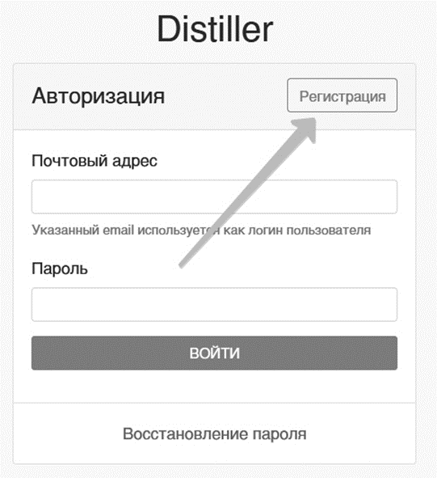
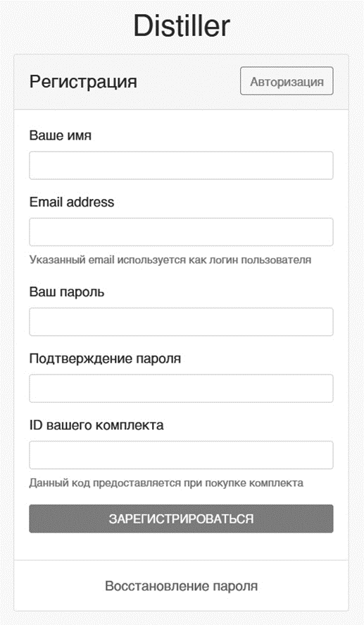
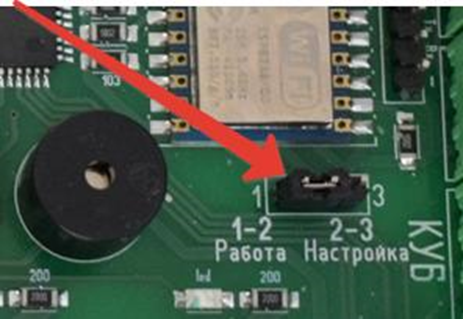

Сайт для удаленного управления – [**www.share-know.ru**](http://www.share-know.ru)

Для начала работы с удаленным доступом, необходимо пройти простую регистрацию на сайте, а так же настроить вашу автоматику для соединения с интернетом.

Первое что необходимо сделать, это зарегистрироваться на сайте, для чего необходимо вверху формы авторизации нажать кнопку регистрация и заполнить данные.



---

*  

   

*  

   



Данные заполняются (ваше имя), адрес электронного почтового ящика (к которому имеется доступ), придумываете пароль и вводите в двух полях ниже, ID вашего комплекта указан в конце данной инструкции **(пароль не должен содержать спец. символов).** Далее необходимо активировать вашу учетную запись, для этого необходимо перейти по ссылке в письме (если письмо не пришло необходимо его проверить в папке **СПАМ**).

После данной операции необходимо перейти к настройке самой автоматики (для подключения ее к интернету вам необходимо иметь точку доступа или телефон, настроенный в режим точки доступа).

Первое что необходимо сделать (при выключенной автоматике), переставить перемычку находящуюся под WI-FI модулем (на фото), в режим настройки **(2 и 3 контакт).**

Далее необходимо включить автоматику, на телефоне или планшете активировать WIFI и в списке сетей найти **точку доступа Distiller и подключиться к ней (возможно будет сообщение что сеть без доступа к интернету, так и должно быть),** открыть любой браузер на телефоне и перейти на страницу [**http://192.168.4.1 **](http://192.168.4.1)где заполнить данные**, имя вашей точки доступа, ключ сети, логин и пароль, указанные при регистрации на сейте.**

Как только высветилось сообщение, что данные сохранены, можно выключить автоматику, переставить перемычку в начальное положение и включить автоматику.

Если все данные указаны, верно, то автоматика подключится к сайту и начнет передавать данные, если этого не произошло, то необходимо повторить процесс настройки, внимательно проверив данные **(Регистр букв имеет значение при вводе!)**

**Ссылка на видео инструкцию** [**https://www.youtube.com/watch?v=GnErytg-lAU**](https://www.youtube.com/watch?v=GnErytg-lAU)