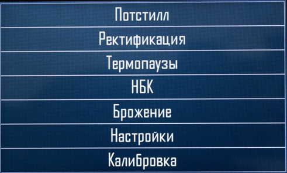
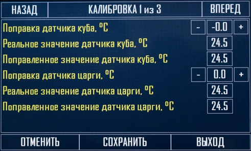
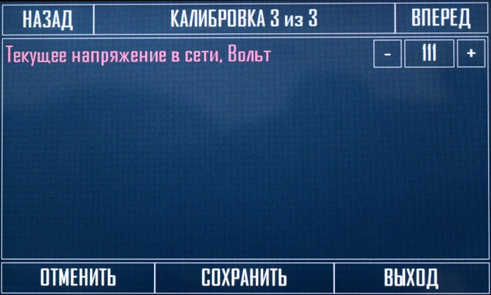
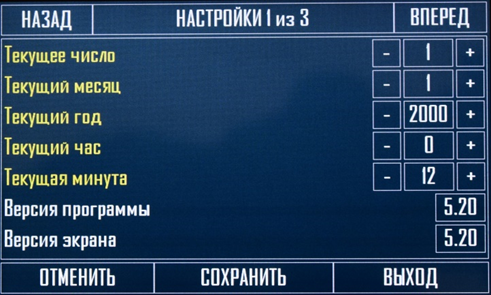
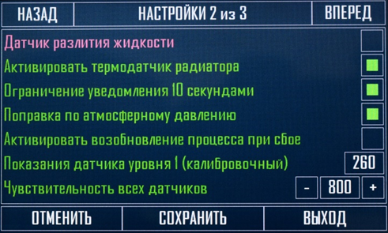
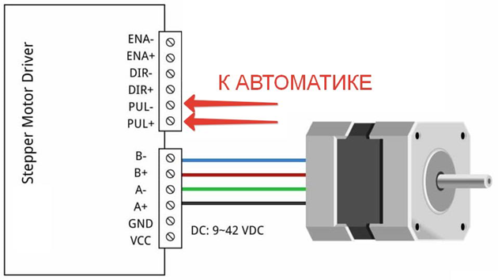
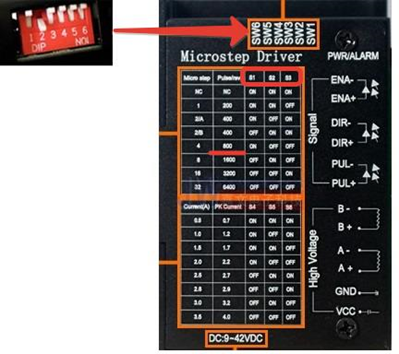
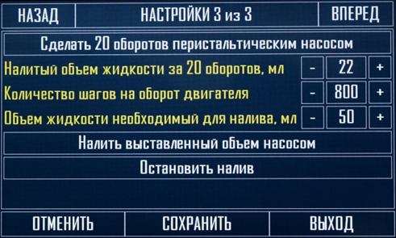

После подключения всех силовых проводов и датчиков приступают к первоначальной настройке автоматики, а именно основных настроек.

Первым делом необходимо откалибровать датчики, так как они имеют небольшую погрешность, но на самом деле это не обязательно (**можно работать и без калибровки**). Калибровка производится по цифровому термометру, которому вы доверяете. Самый простой способ, налить стакан воды, опустить в него все датчики и термометр, по которому вы будете равняться (эталонный), выждать некоторое время, когда показания перестанут меняться и перейти к калибровке. Для этого необходимо перейти через сенсорный экран в меню калибровка датчиков.



---

*  

   

*  

   



Кнопками **назад** и **вперед** можно переключаться между датчиками, **реальное значение** это то значение, которое показывает данный датчик без калибровки, ниже **поправленное значение** это новые показания датчика с калибровкой, кнопками **\+** и **–** выставляется **поправка** данного датчика, необходимо выставить таким образом, чтобы поправленное значение соответствовало показанию эталонного термометра, далее необходимо нажать кнопку сохранить. Данную процедуру необходимо сделать для каждого датчика, переключаясь последовательно между страницами. На этом калибровку датчиков можно считать оконченной, данные сохранятся в энергонезависимую память.

На последней странице калибровки указывается текущее напряжение сети (при продаже автоматики данная настройка уже калибруется), для маленьких экранов данный параметр находится в общих настройках (там где указана версия прошивки). Данный параметр необходим для правильной работы схемы стабилизации мощности на выходе автоматики.

Далее необходимо перейти так же из главного меню в пункт под названием **Настройки**, на первых двух страницах необходимо установить текущие дату и время. Данные настройки необходимы для правильного отображения вашего текущего времени при удаленном доступе (так как часовой пояс у всех разный, и отображать время сервера на вашем графике было бы не правильно), если пользоваться удаленным доступом не планируется, то данную настройку можно пропустить.

**Важно!!!** Кнопки + и – на любых страницах настроек поддерживают длительное удержание для перемотки значений (то есть не нужно много раз нажимать на кнопку, достаточно нажать и удерживать для перемотки до нужного значения). Так же на данной странице можно посмотреть установленную **версию прошивки на плате и экране**.

Следующая страница содержит основные настройки, относящиеся ко всем режимам работы автоматики.

**Датчик разлития жидкости** (подключается к 4 разъему сверху справой стороны платы), данная настройка активирует аварийную остановку любого режима с отключением всего оборудования подключенного к плате при срабатывании датчика разлития.

**Активировать термодатчик радиатора –** данная настройка активирует датчик перегрева радиатора (например, в случае остановки вентилятора или превышении допустимой мощности), данная настройка должна быть отключена для старых плат где данного термодатчика не установлено (платы младше 2021 года), для остальных плат необходимо данную настройку оставить включенной.

**Ограничение уведомления 10 секундами** – при активации данной настройки при аварии, завершении режима, смены емкости и других, внутренний динамик будет издавать писк в течении 10 секунд, в противном случае он будет пищать постоянно пока оператор не нажмет кнопку ок или кнопку старт или стоп с веб интерфейса.

**Поправка по атмосферному давлению** – датчик атмосферного давления встроен на всех платах старше 2021 года, по нему осуществляется корректировка температуры на датчиках (в процессе например ректификации может меняться атмосферное давление, что в свою очередь влияет на температуру кипения жидкости).

**Активировать восстановление процесса при сбое** – работает для всех режимов, в процессе работы может мигнуть свет или произойти кратковременное отключение света, при подаче питания будет восстановлен в работу режим при котором произошел сбой, так же будут восстановлены все параметры, относящиеся к процессу.

**Показания датчика уровня 1** – калибровочным датчиком является первый датчик уровня (третий разъем сверху, с правой стороны платы), он показывает текущие показания датчика. То есть подключается к данному разъему или датчик уровня или датчик разлития, далее инициируем срабатывание. К высвеченной цифре добавляем 100-200 единиц и выставляем это значение ниже в поле – **Чувствительность всех датчиков,** обычно изменение данного параметра не требуется, так же не рекомендуется выставлять данный параметр выше 900 единиц так как возможны ложные срабатывания.

Следующая страница относится к работе **перистальтического насоса (с шаговым двигателем)**, который используется для дозированного налива, подачи браги в непрерывную бражную колонну, а так же отбора голов и тела в ректификации, для правильной работы насоса необходима его калибровка. Автоматика управляет насосом сама, подавая на выход необходимую частоту для вращения двигателя.

Перистальтический насос состоит из головы которая перекачивает жидкость, драйвера двигателя и блока питания, схема такого устройства представлена ниже.



---

*  

   

*  

   



В автоматике подключается к первому сверху справа платы разъему (+ находится вверху).

На драйвере шагового двигателя есть мини переключатели, так же на нем располагается таблица где указано число шагов в зависимости от позиций этих выключателей, это число необходимо выставить в автоматике в пункте (**количество шагов на оборот двигателя**) и нажать кнопку сохранить.

После подключения насоса необходимо опустить забирающую трубку в жидкость и нажать кнопку (сделать 20 оборотов перистальтическим насосом), жидкость начнет перекачиваться, эту процедуру необходимо повторять пока входной и выходной шланг не будут полностью заполнены. Далее подставить мерную колбу и еще раз нажать (**сделать 20 оборотов перистальтическим насосом**.) Полученный объем жидкости выставить в пункте (**Налитый объем жидкости за 20 оборотов,мл**) и нажать кнопку сохранить.

Калибровка насоса на этом окончена.

Если вращение двигателя не происходит при нажатии на кнопку, то необходимо поменять контакты на плате местами.

Остальные пункты в данном меню используются для розлива, при изменении количества жидкости перед наливом необходимо сохранить значение нажатием кнопки сохранить.